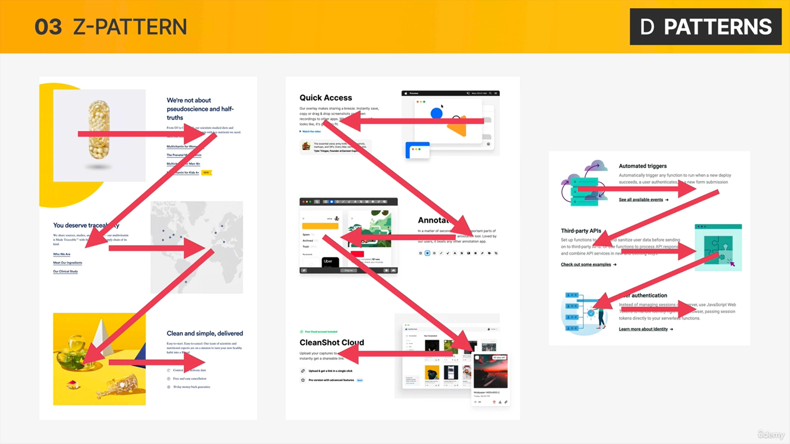
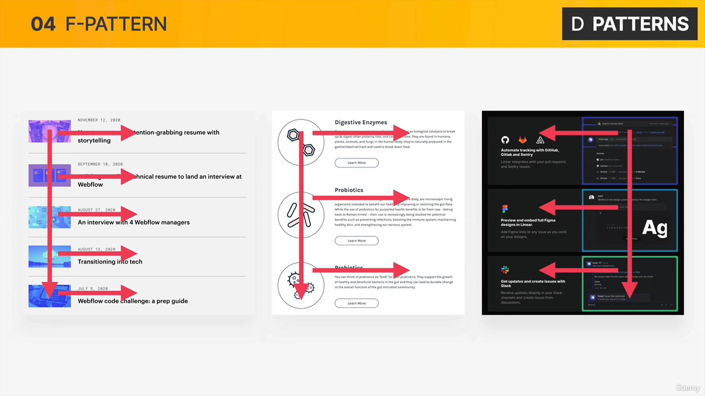
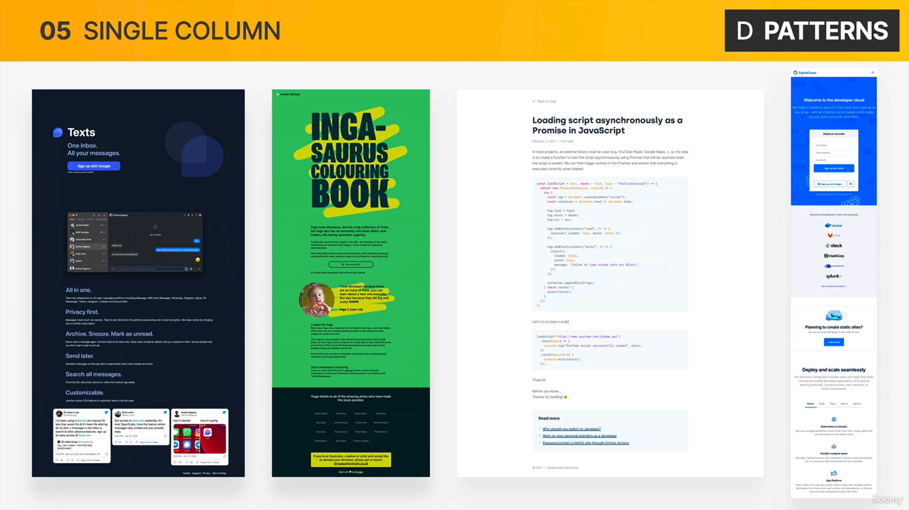
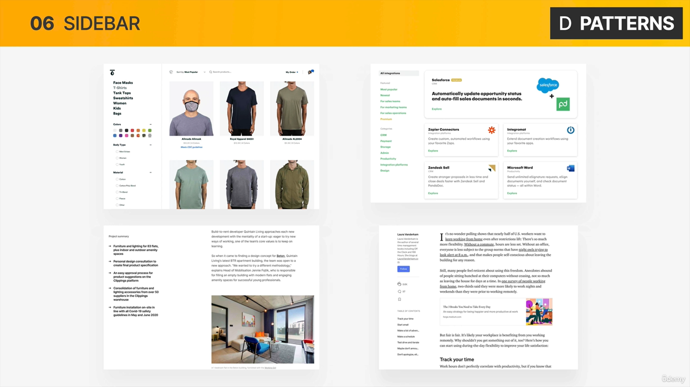
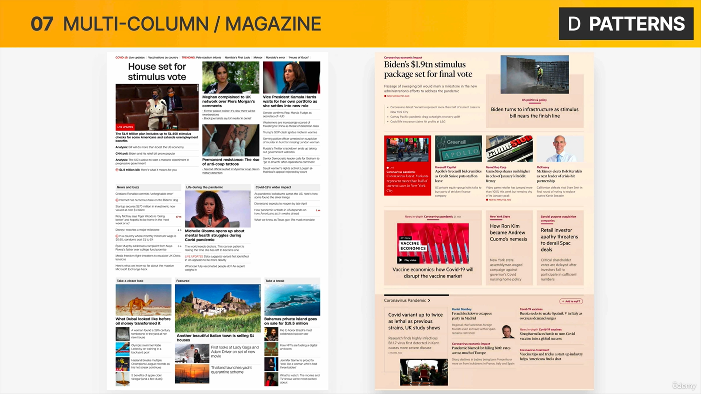
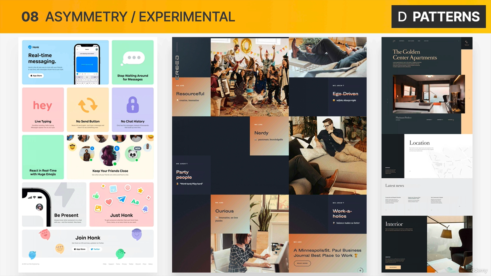

### css
## for hiding elements in css.
```css
display:none;
```
## doubling size of s.th
```css
transform:scale(2);
```
## positioning elements 
The position property specifies the type of positioning method used for an element.   
**There are five different position values:**
``` css
position: static;
position: relative;
position: absolute;
position: fixed;
position: sticky;
```
##  position:static;
The element is positioned according to the Normal Flow of the document. The top, right, bottom, left, and z-index properties have no effect. 
**This is the default value.**
## position:relative;
The element is positioned according to the normal flow of the document, and then offset relative to itself based on the values of top, right, bottom, and left. The offset does not affect the position of any other elements; thus, the space given for the element in the page layout is the same as if position were static.
## position:absolute;
by doing that we take the element completly out of the flow of the page.
**we need to specify inside of the which container these elements should be absolutely positioned,we need to choose the parent 
element and set that one to** * *position:relative* *
## layout patterns
**what is layout pattern?** it is simply a specific way of repeating a certain coponent multiple times. 








