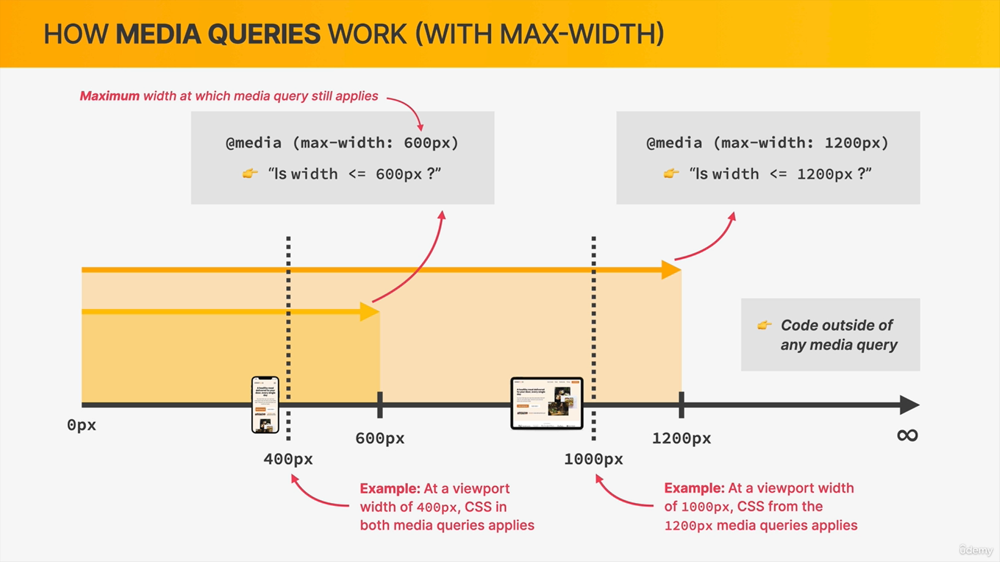
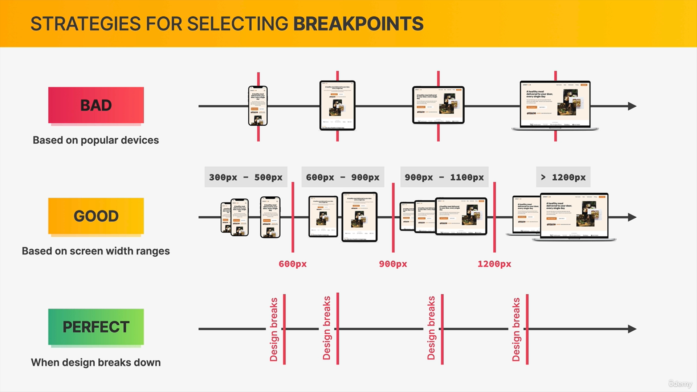

##  strategies for selecting BREAKPOINTS 
it is **good** to use breakpoints based on screen width ranges but it is **prefect**use break points when designs breaks down.
 **create a new file for media queries.**
### Dont use pixels in media queries, like we shoud not use pixels for our layouts.

